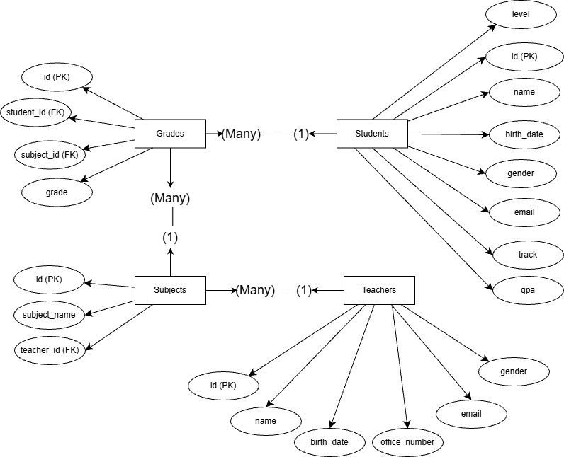

# School Management System Database

## Overview
A relational database project built using MySQL to manage students, teachers, subjects, and grades.

## Features
- Normalized relational schema
- Primary and Foreign Keys
- Data integrity constraints
- Composite UNIQUE constraint
- Reporting View
- Sample data included

## Technologies Used
- MySQL
- SQL (DDL, DML)
- Relational Database Design
- ERD Modeling

## Database Structure
- Students
- Teachers
- Subjects
- Grades

## Relationships
- One-to-Many: Teacher → Subjects
- One-to-Many: Student → Grades
- One-to-Many: Subject → Grades
- Many-to-Many: Students ↔ Subjects (via Grades associative entity)

## Key Concepts Demonstrated
- Primary & Foreign Keys
- One-to-Many Relationships
- Many-to-Many via Associative Entity
- Composite UNIQUE Constraints
- Data Integrity Constraints (CHECK, UNIQUE)
- SQL Views for Reporting
- Aggregation & Grouping Queries

## How to Run
1. Run `schema.sql`
2. Run `sample_data.sql`
3. Run `views.sql`
4. Use `queries.sql` for reports

## ERD Diagram

